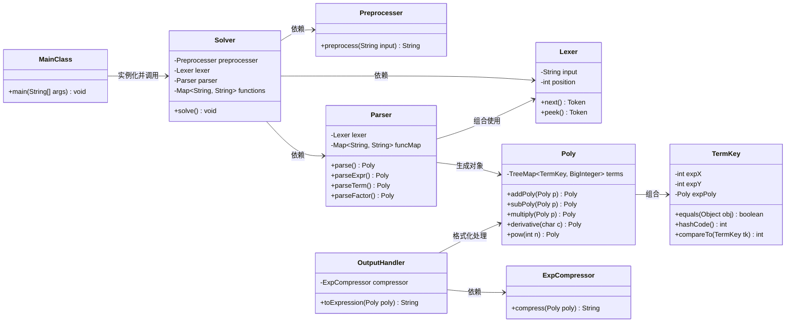
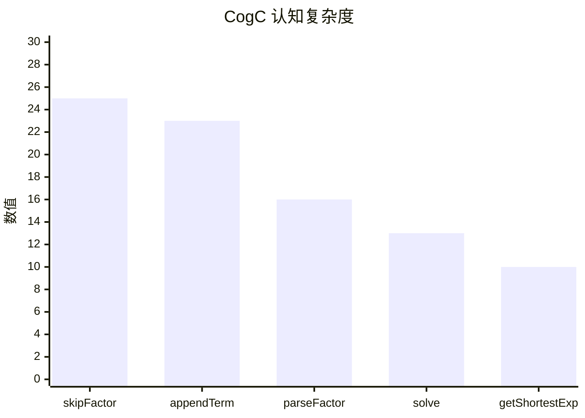
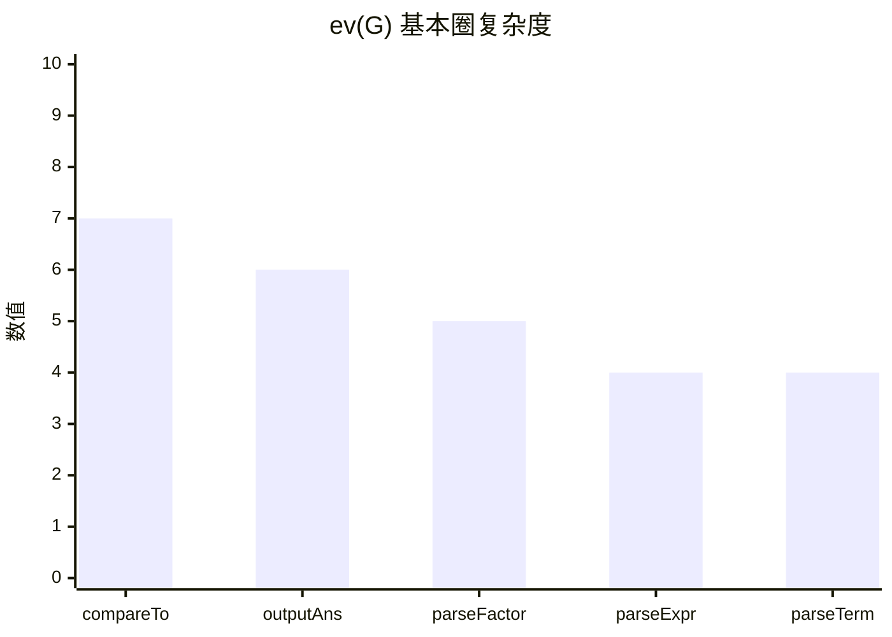
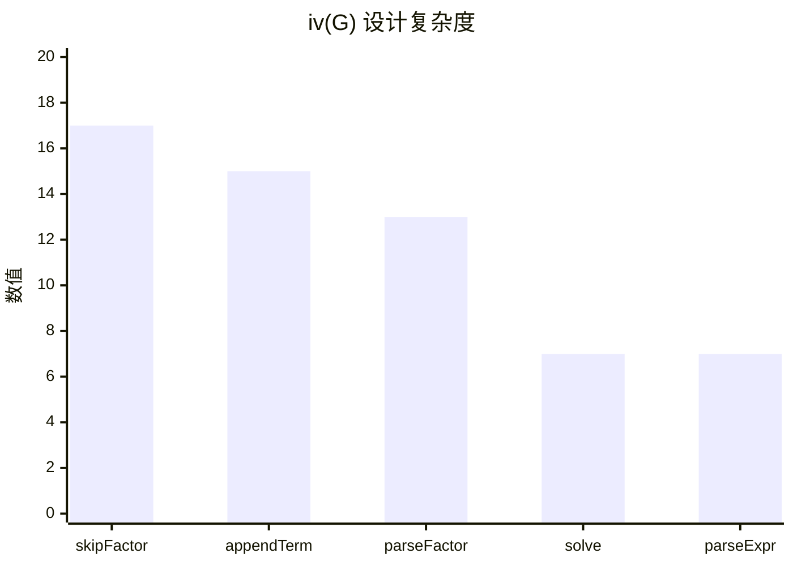
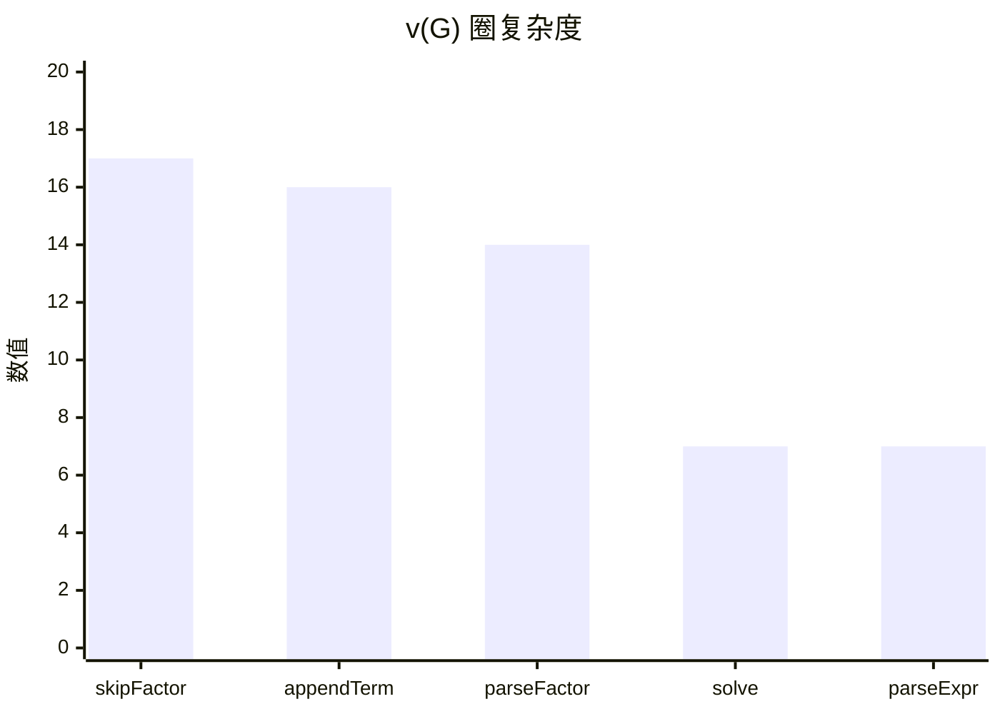

# OO第一单元总结 - 表达式展开

## 题目回顾

**week 1**：读入一个包含加、减、乘、乘方以及括号（其中括号的深度至多为 3 层）的单变量表达式，输出恒等变形展开所有括号后的表达式。

**week 2**：增加了指数函数，自定义函数与三目运算符。

**week 3**：增加了双变量x,y，递推函数与求微分功能。

## 程序整体架构

### 架构分析



优点：职责划分清晰，耦合度低，扩展性强。
缺点：Parser类过于庞大，圈复杂度高，缺少中间层。

### 类复杂度分析


可以看出Parser类圈复杂度过高，不利于维护。

### 方法复杂度分析









### 架构介绍

MainClass：程序入口
Solver：核心调度器
Preprocesser：进行删除空白符，化简连续正负号等预处理操作
Lexer：进行词法分析，将表达式拆分为Token
Parser：进行语法分析，边解析边计算多项式
Poly：存储多项式实体
TermKey：定义同类项，并决定合并于排序规则
ExpCompressor：专门针对exp内部多项式进行数学上的最大公约数提取
OutputHandler：进行输出排版和长度性能优化

## 架构设计体验

### week 1

第一次作业难度较小，整体可以借鉴OOpre中学习过的文法分析方法和递归下降方法。

具体到架构，为了极致简化`MainClass`类，使用`Solver`类作为架构主体，使用`Lexer`和`Parser`类，并对字符串进行去除空白符，正负号合并等预处理操作。`Lexer`类为词法分析器，使用`pos`指针维护记录当前读取位置，`peek()`方法预看当前词但不消耗，`next()`方法消费当前词。`Parser`作为语法解析器，使用`parseExpr()`处理加减，`parseTerm()`处理乘除，`parseFactor()`处理常数和变量。其中通过**递归调用**处理括号嵌套。

多项式化简的核心逻辑是`Mono`类和`Poly`类。`Mono`为原子类，使用`BigInteger`型变量`coeff`和`exp`封装形如$ax^b$的单项式，负责单项式级别的计算（系数相乘，指数相加）。`Poly`为管理类，使用`TreeMap<Integer,Mono>`存储，内含多项式加`addPoly`减`subPoly`乘`multiply`以及幂运算`pow`。

核心算法思想：

- 递归下降
- Map-Based归纳：使用`TreeMap`结构降低合并同类项的时间复杂度。
- 文法分析器`Lexer`和`Parser`
  
**性能优化**：

- 增添了尽可能讲第一项设为正项的逻辑，减少一个负号
- 为后续满足迭代需要，对类进行更细致的划分，增添`InputHandler`类和`OutputHandler`类

### week 2

第二次作业引入了指数函数，自定义函数和三目运算符，需要对第一次作业的架构进行重构。

**重构优化**：废弃`Mono`类，将逻辑合并入`Poly`的`TreeMap`中（重构为更通用的`Term`）；重写`Poly`的存储结构，将`TreeMap<Integer,BigInteger>`改为`TreeMap<TermKey,BigInteger>`，其中存储系数，指数，指数函数因子三个要素，共同完成一个单项式；重构`OutputHandler`，使其直接读取`Poly`里的`Map`进行输出。

**指数函数**：在指数函数中，单项从$ax^n$变为了$ax^nexp(P)$，这意味着原本的`TreeMap`不再能满足存储多项式中每个单向的功能，虽然Java语言中不存在类似元组的便利存储三个信息的数据结构，但是可以使用**TreeMap嵌套**的方法，即：`TreeMap<TermKey,BigInteger>`中，`TermKey`本身也是一个包含`expX`和`expPoly`的复合对象。

有了`exp`，多项式的基本运算规则也发生了变化。加法中，两个项能合并，必须保证`TermKey`完全一致，可以利用`compareTo`方法便利的实现这个功能。乘法中，由于有了$exp(A)*exp(B)=exp(A+B)$这个法则，需要添加将两个项各自的`expPoly`执行`addPoly`的操作。

既然指数函数括号中也可以是一个多项式，显然可以复用HW1中递归下降的方法和思想，在解析到`exp`符号时递归调用`parseFactor`方法，保持代码的简洁性和一致性。

此外还有许多可以进行性能优化的地方，在之后性能优化部分再说。

**自定义函数**：可以采用**宏替换**的思想，优雅地集成到现有架构中。

第一步是读取并存储函数的定义，可以在`Solver`类中维护一个`Map<String,Funcion>`用与存储所有的函数（此处是预先考虑之后可以自定义多个函数的情况）。接下来利用等号分割出函数表达式并使用`Lexer`和`Parser`进行解析。

在正式表达式的解析中，注意要利用`parseFactor`提取实参，替换过程中也一定要注意**形参变实参**，并严格处理优先级，为了防止替换后出现优先级错误，必须将实参包裹在括号内。最后进行递归解析与展开，变为没有自定义函数的表达式即可。

**三目运算符**：实现较为简单，定义`PolyA``PolyB``PolyC``PolyD`表达式然后进行简单的数学运算即可，不过需要注意各种符号的识别，数清括号数量。

**性能优化**：表达式长度的优化主要集中在对指数函数`exp()`的处理上，首先容易想到的是$exp(0)=1$，直接替换即可。

较为复杂的是指数函数中指数的公因子是否需要提取出去，例如$exp((100*x+100))$和$exp((x+1))^100$哪个长度更短。思考数学结论无果后，最终决定采用暴力方法，在处理完函数式后额外增加一个“后处理”流程，把每个涉及到指数函数因子的`Mono`分别计算提出最大公因数和未提出的长度，然后选择较短的那个。

在选择运算符中，可以选择先算出是否相等，再单独解析唯一的结果，可以降低时间复杂度。

**Bug修复**：

- 在函数表达式分析时使用`=`进行分割，导致若定义中出现选择运算，表达式会被分成四份导致无法解析报错。
  - 解决方法：`split("=",2)`限制最高划分数量，只在第一个等号处划分。
- 若函数表达式出现选择运算，会先进行计算再代入表达式，导致如下情况出现错误：
  - 解决方法：先完整替换再进行计算。
  
```Java
1
f(x)=[(x==1)?1:0]
f(1)
```

（后来发现这种输入根本不合法...但是这个细节仍然值得注意，故保留。）

### week 3

第三次作业引进了双变量，微分运算与递推函数，总体难度相比第二次作业有所下降。

双变量的实现十分简单，只需找到Lexer和Parser中所有关于x变量的代码，复制一份换成y即可（如存储结构中增加expY项），并在项合并时注意所有系数指数必须全部吻合。实现逻辑非常简单但还比较考验细节，第一次实现时很容易漏掉某些代码逻辑，不过就算出bug了也很好debug，总体是一个为接下来求偏导与grad做铺垫的功能。

微分运算是这次作业的重点。但由于我们的表达式形式简单，只需建立新方法`Deriavite`按照求导规则进行逐步运算即可，需要注意对双变量的识别，以及求完导后的合并优化。只要学过数学分析应该不是什么难事。

递推函数功能听起来吓人，但由于作业限制最高只需五层迭代，因此几乎不太需要考虑时间复杂度的问题。为了避免进行不必要的计算，我选择在解析完函数定义式后，在解析表达式的过程中就将所有递推函数全部替换为`f{0}`和`f{1}`，这样就可以复用我在第二次作业中额外增加的多函数的代码，将递推函数全部换为两个固定函数。

后续为了进一步优化性能，增加了记忆化搜索，对于已经算出表达式的递推函数，可以在记忆中直接搜索代入，避免多次复杂迭代计算。

## bug分析

本次作业主要在后两次次作业中遇到了bug，且都是TLE问题：

- 在选择表达式中选择无脑将两个结果全部解析，结果强测和互测中均遇到了不需解析且无法快速解析其中一个选项的情况，从而导致TLE，实际上这是一个显而易见的优化思路，没有思考属实经验不足。
- 在遇到过深嵌套时，求最大公因数的算法太慢导致TLE。

此外，第二次作业中还出现了性能分不满的情况，主要是在指数函数项的公因数提取时出现，有些情况下，不将两个指数函数相乘合并反而能提出更大的最大公因数，降低结果强度。

在hack别人过程中，主要在第二次作业中针对TLE问题进行了bug寻找，最终发现在指数函数嵌套许多人出现TLE情况。

## hack策略

无论自测还是互测，主要都分为几个步骤：先进行黑盒测试，测试常见的基础功能；利用评测机测试相对复杂的随机大数据，验证鲁棒性；思考可能出现的极端情况进行测试；最后看代码白盒分析，直接通过代码寻找可能的逻辑漏洞或性能缺陷。

在hack过程中，使用大模型辅助生成了数据生成器和对拍器，但可惜没有通过纯随机的数据生成hack出什么bug。

## 优化分析

第一次作业优化：将表达式首位的负号提到式中以缩短长度。
第二次作业优化：指数函数公因数提取的逻辑优化：将提取前和提取后的式子长度进行比较。（但是到最后也没发现能提取到完美且不TLE的方法...）
第三次作业优化：可以复用前两次的逻辑，没有什么需要优化的地方。

## 大模型相关使用

第一次作业没有使用大模型，但由于对词法分析与文法分析的逻辑生疏，借鉴了github上的往届代码。
第二次作业在基础功能完成期间没有使用大模型，但在性能优化中问了大模型有哪些可以优化的部分，并进行了debug。
第三次作业，在增加双变量时，使用大模型检查了哪些地方没有增加对应的y变量逻辑。

三次作业均用大模型辅助生成了随机数据生成器与对拍机，并使用了大模型阅读他人代码进行hack。

## 心得体会

OO相比OOpre对代码架构更为看重。一个好的架构，面向对象的设计方法，能够增强代码的可读性和可迭代性，对单人项目而言可以有一个清晰的思路，对多人项目而言，更利于互相阅读代码合作。

好的架构需将功能封装独立，满足高内聚低耦合的特征（这个词是在s7h助教的博客中学到的），同时要能够提取共性特性。合理使用继承，多态等面向对象的特性，方便进行统一的管理，减少代码的重复。

由于大模型的日渐强大，许多单独模块的完成已可以靠大模型轻松完成，这时对于架构的优美构建就显得尤其重要，独立设计合理的架构与正确使用大模型进行模块完成，二者相配合才能写出优美，实用，可靠的项目。
